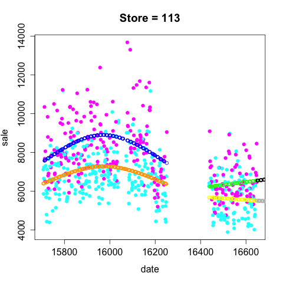
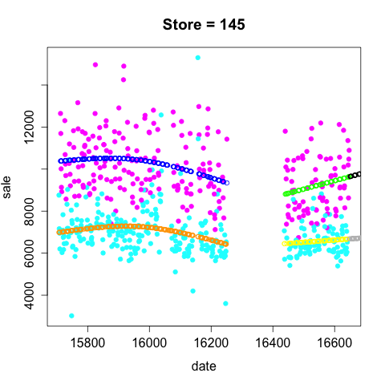
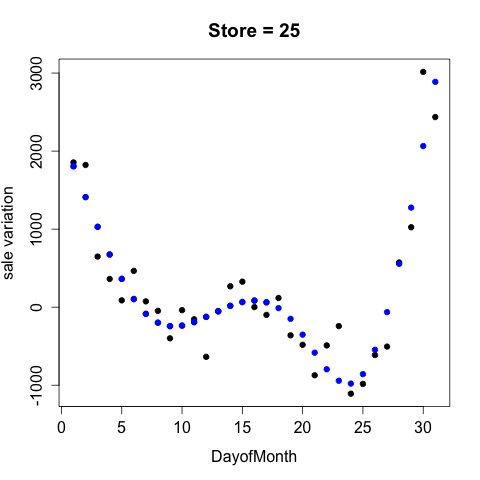
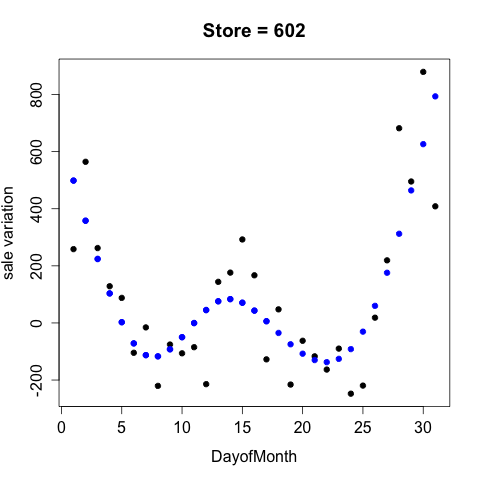
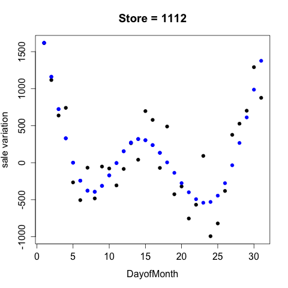

# Sale Forecasting 

*(Rossmann Kaggle Data Science Challenge)*

**GitHub Repository:**

<https://github.com/rmanak/store_sale/>


**Team:**

- Arman Akbarian
- Ali Narimani

## Description

The project is to predict the sale of 1115 stores for the next 2 month given
the sale of the previous 31 month during 2013 - 2015. The sale data
(``train.csv``) contains:

### Data Fields

* **Id**: (Store,Date) unique ID
* **Store**: Store ID (int 1-1115) 
* **Sale**: Sale at the given date for the given store
* **Customers**: Number of costumers that day
* **Open**: If the store is open or not (0,1)
* **StateHoliday**: if the date is one of 4 types of holidays, including None holidays
* **SchoolHoliday**: If the date is a school holiday
* **Promo**: If there is a promotion that day in the store

The (``store.csv``) contains information about each store:

* **StoreType**: Some "type" for stores: 4 category
* **Assortment**: Store assortment, category of 3 types
* **CompetitionDistance**: Distance in meter to the nearest competitor
* **CompetitionOpenSince**: Date the competition opened
* **Promo2**: If store is participating in another seasonal promotion
* **Promo2Since**: Date the promo2 program started
* **PromoInterval**: The month labels that promo2 runs in the store if it participates


### Data Size


The sale date is about \\( 1.01 \times 10^6 \\) training data point for all the 1115 point
The test data (evaluation for competition) contains the next 2 month of
(unknown to us) sale for some of the stores -- about: \\( 4.1 \times 10^4 \\)

* **Train**: 1,017,209
* **Test** :  41,088 (out of the date range of the train set)

### Download data
The data can be downloaded from [[here[>]]](https://www.kaggle.com/c/rossmann-store-sales/data)


****

## Data preprocessing and cleaning

### Merging Store Information
We first merge the store attributes with the training set, and calculate some date variables such
as day of the month, year and month:

```python
import pandas as pd
import numpy as np

types = {'CompetitionOpenSinceYear': np.dtype(int),
         'CompetitionOpenSinceMonth': np.dtype(int),
         'CompetitionDistance' : np.dtype(int),
         'StateHoliday': np.dtype(str),
         'Promo2SinceWeek': np.dtype(int),
         'Promo2SinceYear': np.dtype(int),
         'SchoolHoliday': np.dtype(float),
         'PromoInterval': np.dtype(str)}

train = pd.read_csv('~/kaggledata/rossman/train.csv',
                    parse_dates=['Date'], dtype=types)

test = pd.read_csv('~/kaggledata/rossman/test.csv',
                   parse_dates=['Date'],dtype=types)

store = pd.read_csv('~/kaggledata/rossman/store.csv')

def calcDates(df):
    df['Month'] = df.Date.dt.month
    df['Year'] = df.Date.dt.year
    df['Day'] = df.Date.dt.day
    df['WeekOfYear'] = df.Date.dt.weekofyear
    # Year-Month 2015-08 
    # will be used for monthly sale calculation:
    df['YearMonth'] = df['Date'].apply(lambda x:(str(x)[:7]))
    return df


train = pd.merge(train,store,on='Store')
test = pd.merge(test,store,on='Store')

train = calcDates(train)
test = calcDates(test)

#train.head(10)
#test.head(10)
```


### Cleaning Promo2 and Competition

``Promo2`` variable is given as intervals. For example string of format ``"Apr,May,Aug,Dec"`` and
also the date it starts. We convert this to a single binary variable that indicates if at that date
Promo2 is active or not.

We also build a binary feature that indicates if there exist a competition at a given date or not.
The original version of the given data only indicates when the competition opened.

```python

def cleanPromoCompetition(df,drop=False):
    # ========== Fixing promo2 ============
    df.PromoInterval.fillna(0,inplace=True)
    monthAsString = {1:'Jan', 2:'Feb', 3:'Mar', 4:'Apr', 5:'May', 6:'Jun',
                     7:'Jul', 8:'Aug', 9:'Sept', 10:'Oct', 11:'Nov', 12:'Dec'}

    # Using string format of month names to extract info from promo interval column                 
    df['SMonth'] = df.Month.map(monthAsString)
    # Fixing NaN values in promo interval when there is no promotion
    df.loc[df.PromoInterval==0,'PromoInterval'] = ''

    # New feature: 
    #     IsPromo2Month: 
    #     0 if month is not among PromoInterval
    #     1 if it is


    df['IsPromo2Month'] = 0
    for interval in df.PromoInterval.unique():
        if interval != '':
            for month in interval.split(','):
                condmatch = (df.SMonth == month) & (df.PromoInterval == interval)
                # If promo started this year, Week of Year must be > Promo2SinceWeek
                cond1 = (condmatch & (df.Year == df.Promo2SinceYear)
                         & (df.WeekOfYear >= df.Promo2SinceWeek) )
                # Or If promo started previous year, Week of Year doesn't matter
                cond2 = condmatch & (df.Year > df.Promo2SinceYear)
                fullcond = cond1 | cond2
                df.loc[fullcond, 'IsPromo2Month'] = 1

     # ======= Fixing Competition =============
    df.CompetitionOpenSinceYear.fillna(0,inplace=True)
    df.CompetitionOpenSinceMonth.fillna(0,inplace=True)

    # New feature: 
    #    Competition:
    #    1 if there exist a compettion at date = today
    #    0 otherwise

    df['Competition'] = 0
    cond1 = df.Year > df.CompetitionOpenSinceYear
    cond2 = ((df.Year == df.CompetitionOpenSinceYear)
             & (df.Month >= df.CompetitionOpenSinceMonth))
    fullcond = cond1 | cond2
    df.loc[fullcond, 'Competition'] = 1

    if (drop):
        df = df.drop(['SMonth','PromoInterval','Promo2SinceYear','Promo2SinceWeek'],1)
        df = df.drop(['CompetitionOpenSinceMonth','CompetitionOpenSinceYear'],1)

    return df

train = cleanPromoCompetition(train,drop=True)
test = cleanPromoCompetition(test,drop=True)
```

### Finding Renovated Stores 

As indicated in the project description, some of the stores are gone through renovation process
in late 2014 and re-opened in 2015. We find those stores and build a binary feature that turns on
after renovation. This allows us to do a separate analysis of after renovation, since our exploratory
data analysis indicates that sale sometimes drastically changes after renovation. 

```python
trainOpen = train[train.Open == 1][['Store','YearMonth','Sales']]
monthlySale  = trainOpen.groupby(['Store','YearMonth'],as_index=False).mean()


#====== Finding renovated stores ========

renovatedStores = []
for store in train.Store.unique():
    # Renovated stores are close before 2015 for more than 2 month
    if len(monthlySale[monthlySale.Store==store]) < 29:
        renovatedStores.append(store)


#print(renovatedStores)

def createRenovation(df,renovatedStores):

    # New features:
    # StoreRenovated: 1 if it is, 0 otherwise
    # DaysAfterRenovation: 0 if date is before renovation, 1 if it is after
    df['StoreRenovated'] = 0
    df['DaysAfterRenovation'] = 0
    for store in renovatedStores:
        df.loc[df.Store == store,'StoreRenovated'] = 1
        # Renovated stores are back to open state in 2015
        df.loc[(df.Store == store) & (df.Year == 2015), 'DaysAfterRenovation'] = 1

    return df


train = createRenovation(train,renovatedStores)
test  = createRenovation(test,renovatedStores)


monthlySale['MonthSale'] = monthlySale.Sales
monthlySale = monthlySale.drop(['Sales'],1)

# New feature: MonthSale:
# Average of monthly sale for each store
# Adding monthly sale to train set:
train = pd.merge(train,monthlySale,on=['Store','YearMonth'])


# Small NaN Fix on test, only 1 case which is in fact open
test.Open.fillna(1,inplace=True)


#train = train.sort_values(by = 'Date')
train.to_csv('~/kaggleout/rossman/trainCleaned.csv')
test.to_csv('~/kaggleout/rossman/testCleaned.csv')
```

### Preprocessing code

* [[Full code]](https://github.com/rmanak/store_sale/blob/master/preprocessing.py)


*** 

## Seasonality / Sale Trend and Regression

After exploring the data, we first look into the daily sale and build an "average" sale window for each 
month using a regression model (spline fit). Note that we fit to the after renovated data separately, as 
well as we fit to the days with promotions separately. 

Before looking at the R code, let's take a look at some examples of sale trends of the 2 years for
some of the stores: (magenta indicates days with promotion, cyan is without promotion)

The curved "line dots" indicates the result of the spline regression. The tail black/grey color
indicates the extrapolation of the trend to the test set that is outside the range date for
the train set.

The gap indicates renovation, the fit to the data after renovation is independent of previous sale
before renovation.

### Yearly Trend





Majority of stores follow a similar pattern, however we do have few irregular stores:
[!alt_tag](img/Store_262_SaleTrend.png)


Note that in the code we remove the month of december from regression since in several stores in is a
point of anomoly.

```R
library(readr)
library(splines)

train <- read_csv("~/kaggleout/rossman/trainCleaned.csv")
test  <- read_csv("~/kaggleout/rossman/testCleaned.csv")

# Dropping the index column:
train <- train[,-c(1)]
test <- test[,-c(1)]


sapply(train,function(x)any(is.na(x)))
sapply(test,function(x)any(is.na(x)))


# There are few NAs in competition distance... imputing to the average value 
avg_comp_distance <- mean(train$CompetitionDistance,na.rm=TRUE)
na_idx <- is.na(train$CompetitionDistance)
train$CompetitionDistance[na_idx] <- avg_comp_distance
na_idx <- is.na(test$CompetitionDistance)
test$CompetitionDistance[na_idx] <- avg_comp_distance

# Checking NA values, should return all false
table(is.na(train))
table(is.na(test))

names(train)
str(train)
summary(train)

names(test)
str(test)
summary(test)

# Dropping the days that stores are close
train <- train[ which(train$Open==1),]
train <- train[ which(train$Sales!=0),]

# Dropping Year-Month date:
train$YearMonth <- NULL
test$YearMonth <- NULL

feature.names <- names(train)
cat("Feature Names:\n")
feature.names


# Converting string and characters to categorical variables
for (f in feature.names) {
  if (class(train[[f]])=="character") {
    levels <- unique(c(train[[f]], test[[f]]))
    train[[f]] <- as.integer(factor(train[[f]], levels=levels))
    test[[f]]  <- as.integer(factor(test[[f]],  levels=levels))
  }
}

# New feature: Year trend: 
# Average trend in the sale over the 3 years using a spline fit
train$YearTrend <- 0
test$YearTrend <- 0

# Measuring time in the unit of month:
train$TimeInMonth <- (train$Year - 2013)*12 + train$Month
test$TimeInMonth <- (test$Year - 2013)*12 + test$Month

#----------------------------------------------------------------------
# 6 Category of stores' sale trend
# Store never renovated => 2 category: sale with promotion and without
# Store *is* renovated => 4 category:
#                             sale w / wihtout promo before renovation
#                             sale w / without promo after renovation
-----------------------------------------------------------------------

growthfitnopromo <- NULL
growthfitwithpromo <- NULL
growthfit0nopromo <- NULL
growthfit0withpromo <- NULL
growthfit1nopromo <- NULL
growthfit1withpromo <- NULL

setwd("~/kaggleout/rossman")
for (i in unique(train$Store)) {

cat("fitting store i=",i,"\n")

# Removing December from linear reg. since it is an outlier in most of the stores, 
# The feature will be picked up by a decision tree model, aka. XGBoost 
Store <- train[train$Store==i & train$Month !=12,]

if (Store$StoreRenovated[1] == 0) {

  #=======Without Promo =============
  x <- as.integer(Store[Store$Promo==0,]$Date)
  y <- Store[Store$Promo==0,]$Sales

  growthfitnopromo[[i]] <- lm(y~ns(x,df=2))

  plot(Store$Date,Store$Sales,pch=19,col=Store$Promo+5,
       xlab="date",ylab="sale",main = paste0("Store = ",as.character(i)))

  xx <- as.integer(train[train$Store==i & train$Promo==0,]$Date)
  yy <- predict(growthfitnopromo[[i]],data.frame(x=xx))
  points(xx,yy,col="orange")
  train[train$Store==i & train$Promo==0,]$YearTrend <- yy

  if (i %in% unique(test$Store)) {
    xx <- as.integer(test[test$Store==i & test$Promo==0,]$Date)
    yy <- predict(growthfitnopromo[[i]],data.frame(x=xx))
    test[test$Store==i & test$Promo==0,]$YearTrend <- yy
  }

  #======= With Promo =============

  x <- as.integer(Store[Store$Promo==1,]$Date)
  y <- Store[Store$Promo==1,]$Sales

  growthfitwithpromo[[i]] <- lm(y~ns(x,df=2))


  xx <- as.integer(train[train$Store==i & train$Promo==1,]$Date)
  yy <- predict(growthfitwithpromo[[i]],data.frame(x=xx))
  points(xx,yy,col="blue")
  train[train$Store==i & train$Promo==1,]$YearTrend <- yy

  if (i %in% unique(test$Store)) {
    xx <- as.integer(test[test$Store==i & test$Promo==1,]$Date)
    yy <- predict(growthfitwithpromo[[i]],data.frame(x=xx))
    test[test$Store==i & test$Promo==1,]$YearTrend <- yy
    points(test[test$Store==i,]$Date,test[test$Store==i,]$YearTrend,col=24+test$Promo)
  }

} # End of store *not* renovated 
else {

    # Fitting before renovation:

    #=======Without Promo =============
    x <- as.integer(Store[Store$DaysAfterRenovation==0 &Store$Promo==0,]$Date)
    y <- Store[Store$DaysAfterRenovation==0&Store$Promo==0,]$Sales

    growthfit0nopromo[[i]] <- lm(y~ns(x,df=2))

    plot(as.integer(Store$Date),Store$Sales,pch=19,col=Store$Promo+5,
         xlab="date",ylab="sale",main = paste0("Store = ",as.character(i)))

    xx <- as.integer(train[train$Store==i & train$DaysAfterRenovation==0 & train$Promo==0,]$Date)
    yy <- predict(growthfit0nopromo[[i]],data.frame(x=xx))
    points(xx,yy,col="orange")

    train[train$Store==i & train$DaysAfterRenovation==0 &train$Promo==0,]$YearTrend <- yy


    #=======With Promo =============

    x <- as.integer(Store[Store$DaysAfterRenovation==0 &Store$Promo==1,]$Date)
    y <- Store[Store$DaysAfterRenovation==0&Store$Promo==1,]$Sales

    growthfit0withpromo[[i]] <- lm(y~ns(x,df=2))

    xx <- as.integer(train[train$Store==i & train$DaysAfterRenovation==0 & train$Promo==1,]$Date)
    yy <- predict(growthfit0withpromo[[i]],data.frame(x=xx))
    points(xx,yy,col="blue")

    train[train$Store==i & train$DaysAfterRenovation==0 &train$Promo==1,]$YearTrend <- yy


    # Fitting to after renovation: 

    #=======Without Promo =============
    x <- as.integer(Store[Store$DaysAfterRenovation==1 & Store$Promo==0,]$Date)
    y <- Store[Store$DaysAfterRenovation==1 & Store$Promo==0,]$Sales

    growthfit1nopromo[[i]] <- lm(y~ns(x,df=1))


    xx <- as.integer(train[train$Store==i & train$DaysAfterRenovation==1 & train$Promo==0,]$Date)
    yy <- predict(growthfit1nopromo[[i]],data.frame(x=xx))
    points(xx,yy,col="yellow")
    train[train$Store==i & train$DaysAfterRenovation==1 &train$Promo==0,]$YearTrend <- yy


    if (i %in% unique(test$Store)) {

      if (nrow(test[test$Store==i & test$DaysAfterRenovation==0,]) != 0) {
         # If this happens, there is a bug in data cleaning process
         stop("Something terrible happened!")
      }

      xx <- as.integer(test[test$Store==i & test$Promo==0,]$Date)
      yy <- predict(growthfit1nopromo[[i]],data.frame(x=xx))
      test[test$Store==i & test$Promo==0,]$YearTrend <- yy
    }
    #=======With Promo =============


    x <- as.integer(Store[Store$DaysAfterRenovation==1 & Store$Promo==1,]$Date)
    y <- Store[Store$DaysAfterRenovation==1 & Store$Promo==1,]$Sales

    growthfit1withpromo[[i]] <- lm(y~ns(x,df=1))


    xx <- as.integer(train[train$Store==i & train$DaysAfterRenovation==1 & train$Promo==1,]$Date)
    yy <- predict(growthfit1withpromo[[i]],data.frame(x=xx))
    points(xx,yy,col="green")
    train[train$Store==i & train$DaysAfterRenovation==1 &train$Promo==1,]$YearTrend <- yy

    if (i %in% unique(test$Store)) {

       xx <- as.integer(test[test$Store==i &  test$Promo==1,]$Date)
       yy <- predict(growthfit1withpromo[[i]],data.frame(x=xx))

       test[test$Store==i & test$Promo==1,]$YearTrend <- yy

       points(test[test$Store==i,]$Date,test[test$Store==i,]$YearTrend,col=24+test$Promo)
    }
  } #End of renovation = 1 
fname<-paste0("Store_",as.character(i),"_SaleTrend.png")
dev.copy(png,file=fname); dev.off()
}


listoffits <- c("growthfitnopromo","growthfitwithpromo","growthfit0nopromo",
                "growthfit0withpromo","growthfit1nopromo","growthfit1withpromo")

save(list=listoffits,file="~/all_fits_sep_pro_sep_renovation.RData")


# Subtracting the yearly trend of growth/decay of sale:
train$Sales2 <- train$Sales
train$Sales <- train$Sales - train$YearTrend

#save(list=c("train"),file="~/train_set_with_Year_Trend.RData")
#save(list=c("test"),file="~/test_set_with_Year_Trend.RData")

```


### Monthly Trend

After removing the yearly trend of sale growth/decay. It makes more sense to bin the data to day of
month, and we observe strong indication of a seasonality in month that sale is higher near the beginning
and end of the month, and also slightly higher in the middle. We also extracted this signal. 

Let's first take a look at some of the stores sale: (the blue dots indicate
the spline fit) 







The implementation is below:

```R
# Exploring the monthly trend:
monthfit <- NULL
train$MonthTrend <- 0
test$MonthTrend <- 0
for (i in unique(train$Store)) {
  cat("doing Store =",i,"\n")
  Store <- train[train$Store==i ,]
  y <- by(Store$Sales, Store$Day, mean)
  x <- as.integer(names(y))
  monthfit[[i]] <- lm(y~ns(x,df=5))
  plot(x,y,pch=19,xlab="DayofMonth",ylab="sale variation",main = paste0("Store = ",as.character(i)))

  xx <- train[train$Store==i,]$Day
  yy <- predict(monthfit[[i]], data.frame(x=xx))
  train[train$Store==i,]$MonthTrend <- yy

  if (i %in% unique(test$Store)) {
    xx <- test[test$Store==i,]$Day
    yy <- predict(monthfit[[i]],data.frame(x=xx))
    test[test$Store==i,]$MonthTrend <- yy
    points(test[test$Store==i,]$Day,test[test$Store==i,]$MonthTrend,col="blue",pch=19)
  }
  fname<-paste0("Store_",as.character(i),"_MonthTrend.png")
  dev.copy(png,file=fname); dev.off()
}

save(list=c("monthfit"),file="~/all_monthfits.RData")

train$Sales3 <- train$Sales
train$Sales <- train$Sales - train$MonthTrend


#save(list=c("train"),file="~/train_set_with_Month_Trend.RData")
#save(list=c("test"),file="~/test_set_with_Month_Trend.RData")


train$SaleSD <- 1
test$SaleSD <- 1
for (i in unique(train$Store)) {
  sd_sale <- sd(train[train$Store==i ,]$Sales)
  cat("doing Store i=",i,"sd=",sd_sale,"\n")
  train[train$Store==i,]$SaleSD <- sd_sale
  if (i %in% unique(test$Store)) {
    test[test$Store==i,]$SaleSD <- sd_sale
  }
}

train$Sales4 <- train$Sales
# Normalizing sale of stores by their standard deviation
train$Sales <- train$Sales / train$SaleSD

write_csv(train, "~/kaggleout/rossman/train_normalized.csv")
write_csv(test,"~/kaggleout/rossman/test_normalized.csv")

```

Finally we store the normalized data for the final step of the ML pipeline. 

### Regression Code

* [[Ful code]](https://github.com/rmanak/store_sale/blob/master/regression.R)

****

## Non-linear features / XGB

Finally to extract the nonlinear features such as dependency of the sale on day of week
or its dependency on when promo2 is on as well as interaction terms such as 
(end of month x Friday) we use a gradient boosting decision tree:

So in summary our machine learning pipeline looks like the following:


```python
import pandas as pd
import numpy as np
from sklearn.cross_validation import train_test_split
import xgboost as xgb
import matplotlib.pyplot as plt
import os


types = {'Store':np.dtype(int),
         'DayOfWeek': np.dtype(int),
         'Sale' : np.dtype(float),
         'Promo' : np.dtype(int),
         'SchoolHoliday': np.dtype(int),
         'StateHoliday': np.dtype(int),
         'StoreType': np.dtype(int),
         'Assortment': np.dtype(int),
         'CompetitionDistance' : np.dtype(float),
         'IsPromo2Month': np.dtype(int),
         'Competition': np.dtype(int),
         'StoreRenovated': np.dtype(int),
         'DaysAfterRenovation' : np.dtype(int),
         'MonthSale': np.dtype(float),
         'Month':np.dtype(int),
         'Day':np.dtype(int)
}

train = pd.read_csv("~/kaggleout/rossman/train_normalized.csv",
                    parse_dates=['Date'], dtype=types)
test = pd.read_csv("~/kaggleout/rossman/test_normalized.csv",
                   parse_dates=['Date'], dtype=types)

# Some new feature engineering:
def extendFeatures(df):
    df['Friday'] = 0
    df['EarlyInMonth'] = 0
    df['LateInMonth'] = 0
    df['December'] = 0
    df['ChristmasTime'] = 0
    df.loc[df.DayOfWeek == 5,'Friday'] = 1
    df.loc[df.Day < 5, 'EarlyInMonth'] = 1
    df.loc[df.Day > 25, 'LateInMonth'] = 1
    df.loc[df.Month == 12,'December'] = 1
    isXmas = (df.Month == 12) & (df.Day > 23)
    df.loc[isXmas, 'ChristmasTime'] = 1
    return df

train = extendFeatures(train)
test = extendFeatures(test)


# print train.columns.values


# Keeping out the last two month for cross validation
cvtest = train[train.Date > '2015-06-30']
train = train[train.Date < '2015-07-01']


features = ['Store', 'DayOfWeek', 'Promo',  'StateHoliday',
            'SchoolHoliday', 'StoreType', 'Assortment',
            'CompetitionDistance', 'Month', 'Year', 'Day',
            'IsPromo2Month', 'Competition','StoreRenovated',
            'DaysAfterRenovation','Friday','EarlyInMonth','LateInMonth',
            'December','ChristmasTime']

#XGboost params: (set for quick run, not high accuracy)
params = {"objective": "reg:linear",
          "booster" : "gbtree",
          "eta": 0.2,
          "max_depth": 10,
          "subsample": 0.9,
          "colsample_bytree": 0.7,
          "silent": 1,
          "thread": 1,
          "seed": 2015
          }
# For the final run should try 1000+ iteration at eta < 0.02
num_boost_round = 200


X_train, X_valid = train_test_split(train, test_size=0.012, random_state=10)
y_train = np.array(X_train.Sales)
y_valid = np.array(X_valid.Sales)
dtrain = xgb.DMatrix(X_train[features], y_train)
dvalid = xgb.DMatrix(X_valid[features], y_valid)

watchlist = [(dtrain, 'train'), (dvalid, 'eval')]

def rmse(y, yhat):
    return np.sqrt(np.mean((yhat - y) ** 2))

def rmse_xg(yhat, y):
    y = np.array(y.get_label())
    yhat = np.array(yhat)
    return "rmse", rmse(y,yhat)

def rmspe(y,yhat):
    return np.sqrt(np.mean( ((y-yhat) / y)**2 ) )

# Training the tree:
gbm = xgb.train(params, dtrain, num_boost_round, evals=watchlist,
                early_stopping_rounds=100, feval=rmse_xg, verbose_eval=True)

print("Make predictions on the cvtest set")
dtest = xgb.DMatrix(cvtest[features])
test_preds = gbm.predict(dtest)
test_sales = (test_preds*np.array(cvtest.SaleSD) + np.array(cvtest.MonthTrend)
              + np.array(cvtest.YearTrend))

error = rmspe(cvtest.Sales2, test_sales)
print('RMSPE: {:.6f}'.format(error))

os.chdir("/Users/arman")

plt.plot(cvtest.Sales2,test_sales,'bo',cvtest.Sales2,cvtest.Sales2,'k')
plt.title('Cross validation for 1115 stores \n for the last two month of train set')
plt.xlabel('Actual Sale')
plt.ylabel('Predicted Sale')
plt.savefig("cv.png",dpi=200)

# Predicting for the test set:
dtest = xgb.DMatrix(test[features])
test_preds = gbm.predict(dtest)
test_sales = (test_preds*np.array(test.SaleSD) + np.array(test.MonthTrend)
              + np.array(test.YearTrend))

submissionDF = pd.DataFrame({'Id': test['Id'], 'Sales': test_sales})
submissionDF.to_csv("submission.csv",index=False)
```

### code

* [[Full code]](https://github.com/rmanak/store_sale/blob/master/XGB.py)

## Cross Validation

Note that the code above performs a cross validation by holding the last two month of the train set out
of the XGBoost. (Also XGBoost has it's own built in CV monitoring). Following plot demonstrates the
predicted sale vs actual sale for the cross validation set with RMSPE score of 0.14 


