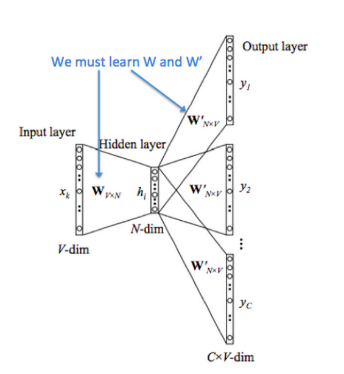
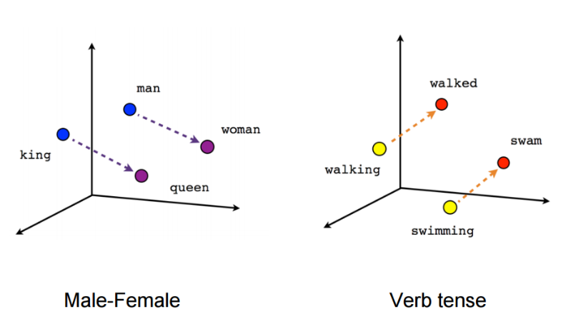

## Word embedding & Co-occurance Matrix

So far we assumed that words are atomic type, i.e. has no semantic relation,
while that's not the case in reality! How can we 
create a vector space for words that vectors actually represent meaning? 

Another problem with VSM (one-hot representation of documents)
is that each document will have many features in their vectors and will be highly sparse. 
(Typical corpus of english words will have ~ 50K unique words, therefore each document is a 1 x 50K vector)

### SVD based model
One way to approach the problem is to assume a word's "meaning" is encoded on which document it appears.
In addition, words that occur in the same document must have some semantic relation.
Consider the word-document matrix, where element `A[i,j]` represent count of the word `w_j` in 
document `d_i`. (Each row of the matrix is one document in one-hot encoding as we discussed above)
Then we can perform SVD and use the enough number of principle components that captures most of the variance in
the word-document matrix. Then 
the latent space components are the lower dimensional representation of the words and the documents.
These "classical" model existed for a long time but a full matrix factorization on a large corpus
is computationally (and memory-wise) intensive. Recent work in distributed representation of words
(Google's word2vec) uses an iterative approach that is fast and incremental (learning can be resumed).

*Note*: Looking at how much development happened in Deep learning since 2013, I guess word2vec doesn't count as
"recent development" anymore! 

*Note*: If you think this method is similar to topic modeling 
and [LSA](https://en.wikipedia.org/wiki/Latent_semantic_analysis), it is exactly that!

### Continuous representation, Window-based co-occurance matrix.
### Continuous bag of words model (CBOW)

Introduced  [[+]](http://arxiv.org/pdf/1301.3781.pdf), the model is based on the fact that using
the words context (surrounding words) one should be able to predict the word.


### Skip-gram model 

Described in [[+]](http://papers.nips.cc/paper/5021-distributed-representations-of-words-and-phrases-and-their-compositionality.pdf)
the model assumes that using the word one should be able to predict the surrounding words.



#### What to expect if the vectors have real meaning?

It should capture semantic relations:



Another cool representation from Google's blog:


```python
from gensim.models import Word2Vec

bin_file='/Users/arman/word2vec-mac/vectors.bin'

model = Word2Vec.load_word2vec_format(bin_file, binary=True)
```

Now remove the ';' from the following and see what you get!

```python
model.most_similar(positive=['italy', 'paris'], negative=['rome']);
model.most_similar(positive=['grandfather','mother'],negative=['father']);
model.most_similar(positive=['night', 'sun'], negative=['day']);
model.most_similar(positive=['air', 'car'], negative=['street']);
model.most_similar(positive=['small','cold'],negative=['large']);
model.most_similar(positive=['art','experiment'],negative=['science']);
model.most_similar(positive=['men','car'],negative=['man']);
```


### All of the python codes in this section are in the [intro.py](https://github.com/rmanak/nlp_tutorials/blob/master/intro.py) script.

## Example: Sentiment Analysis (Kaggle competition)

Now we use the Kaggle competition: <https://www.kaggle.com/c/word2vec-nlp-tutorial/> as an example to demonstrate what we've learned so far.

See the notebook [popcorn.ipynb](https://github.com/rmanak/nlp_tutorials/blob/master/popcorn.ipynb)

## Credit

Pretty much everything (diagrams particularly) was stolen from some awesome 
blog posts, open source repositories etc. So I do not take any credit for
anything here! I will hopefully update this repository with proper 
citations. Meanwhile, please see the following links for the references 
and other resources to learn from.


## Links

<http://www.nltk.org/book/>

<http://cs224d.stanford.edu/syllabus.html>

<http://papers.nips.cc/paper/5021-distributed-representations-of-words-and-phrases-and-their-compositionality.pdf>

<http://arxiv.org/pdf/1301.3781.pdf>

<http://research.microsoft.com/pubs/189726/rvecs.pdf>

<http://nlp.stanford.edu/pubs/glove.pdf>

<http://www.aclweb.org/anthology/P12-1092>


<http://rare-technologies.com/deep-learning-with-word2vec-and-gensim/>

<https://code.google.com/archive/p/word2vec/>

<http://radimrehurek.com/gensim/tutorial.html>

<http://benjaminbolte.com/blog/2016/keras-language-modeling.html#characterizing-the-attentional-lstm>

<https://github.com/piskvorky/gensim>

<http://rare-technologies.com/word2vec-tutorial>

<http://google-opensource.blogspot.ca/2013/08/learning-meaning-behind-words.html>

<https://github.com/piskvorky/gensim/blob/develop/gensim/models/word2vec.py>

<http://arxiv.org/pdf/1506.03340v3.pdf>

<https://github.com/codekansas/keras-language-modeling>

<https://github.com/deepmind/rc-data>

<http://multithreaded.stitchfix.com/blog/2015/03/11/word-is-worth-a-thousand-vectors/>

<http://blog.echen.me/2011/08/22/introduction-to-latent-dirichlet-allocation/>

<https://arxiv.org/abs/1605.02019>

<https://github.com/cemoody/lda2vec>

<http://lda2vec.readthedocs.io/en/latest/>

<https://ayearofai.com/lenny-2-autoencoders-and-word-embeddings-oh-my-576403b0113a>

<https://docs.google.com/file/d/0B7XkCwpI5KDYRWRnd1RzWXQ2TWc/edit>

<https://github.com/vinhkhuc/kaggle-sentiment-popcorn>

<http://arxiv.org/abs/1412.5335>

<http://stanfordnlp.github.io/CoreNLP/>

<https://github.com/jeffreybreen/twitter-sentiment-analysis-tutorial-201107>

<http://www.idiap.ch/~apbelis/hlt-course/negative-words.txt>

<http://www.idiap.ch/~apbelis/hlt-course/positive-words.txt>

<https://dumps.wikimedia.org/enwiki/>

<https://dumps.wikimedia.org/enwiki/latest/enwiki-latest-pages-articles.xml.bz2>

<http://nlp.stanford.edu/pubs/glove.pdf>

<http://nlp.stanford.edu/projects/glove/>

<https://github.com/stanfordnlp/GloVe>

<http://www.cs.princeton.edu/~blei/papers/HoffmanBleiBach2010b.pdf>

<http://nbviewer.jupyter.org/github/danielfrg/word2vec/blob/master/examples/word2vec.ipynb>

<http://mattmahoney.net/dc/textdata.html>

<http://cs224d.stanford.edu/syllabus.html>

<http://www-personal.umich.edu/~ronxin/pdf/w2vexp.pdf>

<https://class.coursera.org/nlp/lecture/preview>

<https://www.tensorflow.org/versions/r0.8/tutorials/word2vec/index.html>

